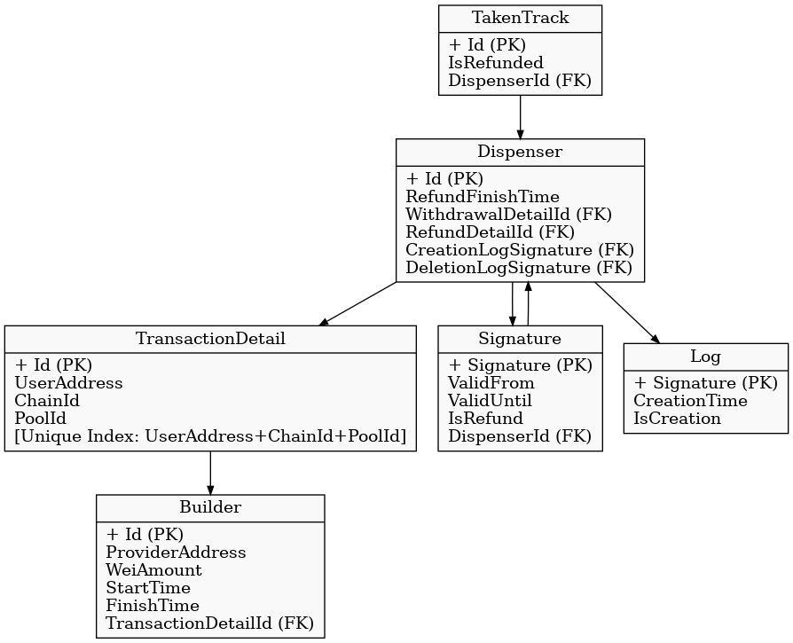

# DispenserProvider.DataBase

**DispenserProvider.DataBase** is the EF Core-based database layer for the Lock Deal NFT system within the Poolz ecosystem.
It manages off-chain data to support secure and efficient token distribution across multiple EVM-compatible networks.

## 📌 Purpose

This project stores and manages data for:

- Dispenser pools created by project owners
- User allocation details and signatures
- Distribution tracking and logging

It acts as a backend data source for the Dispenser Provider service, which works together with smart contracts to deliver time-locked NFT rewards to users.

## 🧩 Database Overview

Main entities:

- **Dispenser** — central token pool entry; links to transaction, signature, and log data  
- **TransactionDetails** — records of user allocations per chain/pool  
- **Signature** — one-time, time-limited authorization tokens for claiming NFTs  
- **Builder** — identifies who created the dispenser (usually the project)  
- **Log** — creation and deletion events for tracking changes  
- **TakenTrack** — marks whether a claim was already made (prevents double-claim)

📷 Diagram:  

> The schema enforces strict relationships between records (via foreign keys) to ensure consistency and prevent orphaned or invalid entries.

## 🛡️ Security Notes

- **Signatures are one-time and expire after a short duration**
- Each signature is **bound to a specific user address** and validated on-chain
- On successful claim, the system records usage in `TakenTrack`
- All sensitive signing happens outside this DB layer — **no private keys are stored**

> This design ensures secure off-chain signature handling, while smart contracts enforce validity and usage on-chain.

## 🌍 Multi-Chain Support

DispenserProvider is deployed on multiple EVM chains. This database layer is chain-agnostic and supports cross-chain tracking and refund logic.